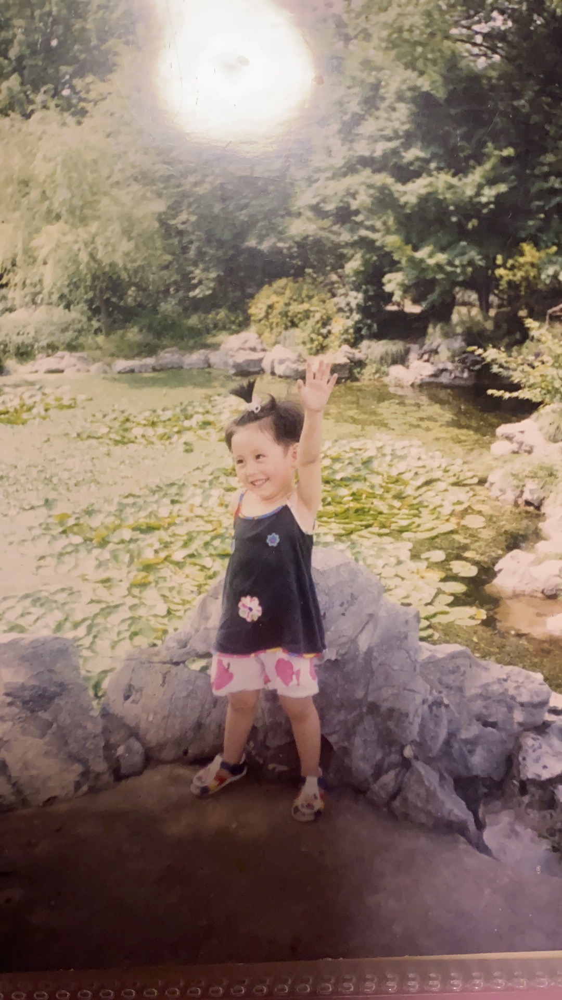
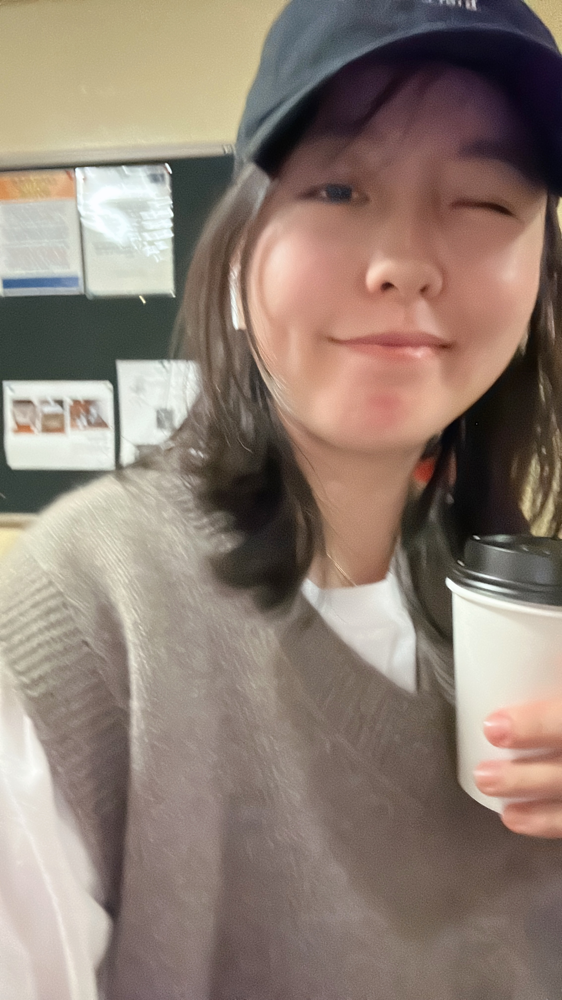

# Here is Fei's website 

 LOL, here is the Fei Xiao's website. I am creating this website for my homework 4, Jeff says the website will be useful, and we will see....

# How Fei looks like? 

 It's me!! 

and 20 years later 

# if you want to know more about me 
[about me](about.html)

